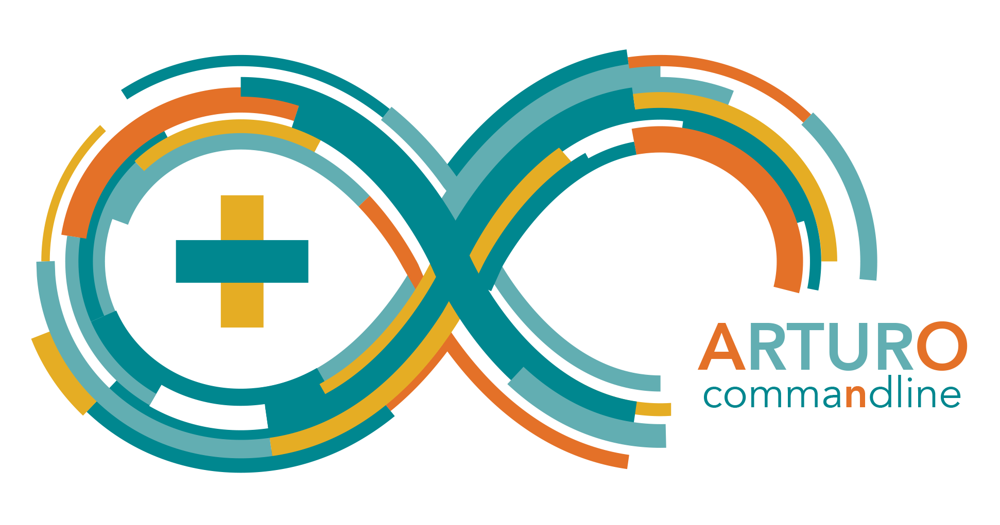

## Introducing Arturo

> A command-line tool for Arduino 1.6.1 or earlier

This is a fork from [ino/master](https://github.com/amperka/ino/commit/f23ee5cb14edc30ec087d3eab7b301736da42362).
The original ino contributors did a fantastic job but they decided they no longer
had time to maintain this tool. I asked them if they wanted me to take over ino
but they preferred that I fork it. And so Arturo was born.

Unfortunatly the Arduino IDE completely changed 3p integration in version 1.6.2 and Arturo is currently broken
for this version. I will try to fix this but it will require a significant rewrite and could take some time.

Stay tuned for more details and changes. I do plan on going through the existing
ino PRs and issues to see if there's anything I can fix.

I am looking for other contributors as well. I especially need Windows and Linux
testers as I'm doing all this work on a mac.

## Installing Arturo

Clone this repo, `cd Arturo`, `make install`. On Linux you may need to use `sudo make install`.

Remember that the Arturo command is ```ano```. It should not conflict in any way
with ino and you can install the two side-by-side (please file any issues if this
is not true).

You might want to add the new ```.build_ano``` build output folder to your .gitignore.


## Getting Started

There is an excellent [getting started guide for ino](http://inotool.org/quickstart) that contains
everything you should need to get the Blink program running on your board.

## Troubleshooting

HALP!  I am getting:
```
avrdude: stk500_recv(): programmer is not responding
avrdude: stk500_getsync() attempt 1 of 10: not in sync: resp=0x00
avrdude: stk500_recv(): programmer is not responding
avrdude: stk500_getsync() attempt 2 of 10: not in sync: resp=0x00
...
```

The `-m` flag is particularly important and your upload may fail with the above error if
you did not include it.

For information about ano commands run:
```
ano --help
```
and
```
ano <subcommand> --help
```
